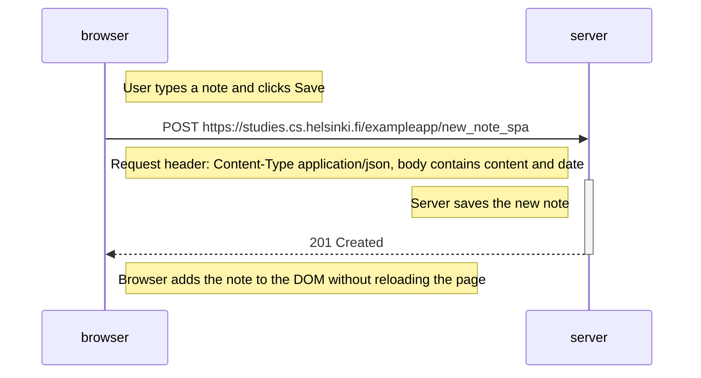

```mermaid
sequenceDiagram
    participant browser
    participant server

    Note right of browser: User types a note and clicks Save
    browser->>server: POST https://studies.cs.helsinki.fi/exampleapp/new_note_spa
    Note right of browser: Request header: Content-Type application/json, body contains content and date
    activate server
    Note left of server: Server saves the new note
    server-->>browser: 201 Created
    deactivate server
    Note right of browser: Browser adds the note to the DOM without reloading the page
```